```mermaid
flowchart TB
    subgraph current["Desktop.csproj"]
        MAIN["<b>📦&nbsp;Desktop.csproj</b><br/><small>net10.0-windows</small>"]
        click MAIN "#srcdesktopdesktopcsproj"
    end

```

```mermaid
flowchart TB
    subgraph current["Mobile.csproj"]
        MAIN["<b>📦&nbsp;Mobile.csproj</b><br/><small>net10.0-android;net10.0-windows10.0.19041.0</small>"]
        click MAIN "#srcmobilemobilecsproj"
    end

```

```mermaid
flowchart TB
    subgraph current["Server.csproj"]
        MAIN["<b>📦&nbsp;Server.csproj</b><br/><small>net10.0</small>"]
        click MAIN "#srcserverservercsproj"
    end

```

# Projects and dependencies analysis

This document provides a comprehensive overview of the projects and their dependencies in the context of upgrading to .NETCoreApp,Version=v10.0.

## Table of Contents

- [Executive Summary](#executive-Summary)
  - [Highlevel Metrics](#highlevel-metrics)
  - [Projects Compatibility](#projects-compatibility)
  - [Package Compatibility](#package-compatibility)
  - [API Compatibility](#api-compatibility)
- [Aggregate NuGet packages details](#aggregate-nuget-packages-details)
- [Top API Migration Challenges](#top-api-migration-challenges)
  - [Technologies and Features](#technologies-and-features)
  - [Most Frequent API Issues](#most-frequent-api-issues)
- [Projects Relationship Graph](#projects-relationship-graph)
- [Project Details](#project-details)

  - [src\Desktop\Desktop.csproj](#srcdesktopdesktopcsproj)
  - [src\Mobile\Mobile.csproj](#srcmobilemobilecsproj)
  - [src\Server\Server.csproj](#srcserverservercsproj)

## Executive Summary

### Highlevel Metrics

| Metric | Count | Status |
| :--- | :---: | :--- |
| Total Projects | 3 | 0 require upgrade |
| Total NuGet Packages | 18 | All compatible |
| Total Code Files | 54 |  |
| Total Code Files with Incidents | 0 |  |
| Total Lines of Code | 4378 |  |
| Total Number of Issues | 0 |  |
| Estimated LOC to modify | 0+ | at least 0.0% of codebase |

### Projects Compatibility

| Project | Target Framework | Difficulty | Package Issues | API Issues | Est. LOC Impact | Description |
| :--- | :---: | :---: | :---: | :---: | :---: | :--- |
| [src\Desktop\Desktop.csproj](#srcdesktopdesktopcsproj) | net10.0-windows | ✅ None | 0 | 0 |  | WinForms, Sdk Style = True |
| [src\Mobile\Mobile.csproj](#srcmobilemobilecsproj) | net10.0-android;net10.0-windows10.0.19041.0 | ✅ None | 0 | 0 |  | ClassLibrary, Sdk Style = True |
| [src\Server\Server.csproj](#srcserverservercsproj) | net10.0 | ✅ None | 0 | 0 |  | AspNetCore, Sdk Style = True |

### Package Compatibility

| Status | Count | Percentage |
| :--- | :---: | :---: |
| ✅ Compatible | 18 | 100.0% |
| ⚠️ Incompatible | 0 | 0.0% |
| 🔄 Upgrade Recommended | 0 | 0.0% |
| ***Total NuGet Packages*** | ***18*** | ***100%*** |

### API Compatibility

| Category | Count | Impact |
| :--- | :---: | :--- |
| 🔴 Binary Incompatible | 0 | High - Require code changes |
| 🟡 Source Incompatible | 0 | Medium - Needs re-compilation and potential conflicting API error fixing |
| 🔵 Behavioral change | 0 | Low - Behavioral changes that may require testing at runtime |
| ✅ Compatible | 0 |  |
| ***Total APIs Analyzed*** | ***0*** |  |

## Aggregate NuGet packages details

| Package | Current Version | Suggested Version | Projects | Description |
| :--- | :---: | :---: | :--- | :--- |
| Avalonia | 11.2.2 |  | [Desktop.csproj](#srcdesktopdesktopcsproj) | ✅Compatible |
| Avalonia.Controls.DataGrid | 11.2.2 |  | [Desktop.csproj](#srcdesktopdesktopcsproj) | ✅Compatible |
| Avalonia.Desktop | 11.2.2 |  | [Desktop.csproj](#srcdesktopdesktopcsproj) | ✅Compatible |
| Avalonia.Fonts.Inter | 11.2.2 |  | [Desktop.csproj](#srcdesktopdesktopcsproj) | ✅Compatible |
| Avalonia.Themes.Fluent | 11.2.2 |  | [Desktop.csproj](#srcdesktopdesktopcsproj) | ✅Compatible |
| CommunityToolkit.Mvvm | 8.3.2 |  | [Desktop.csproj](#srcdesktopdesktopcsproj) [Mobile.csproj](#srcmobilemobilecsproj) | ✅Compatible |
| Microsoft.AspNetCore.Authentication.JwtBearer | 10.0.1 |  | [Server.csproj](#srcserverservercsproj) | ✅Compatible |
| Microsoft.AspNetCore.OpenApi | 10.0.1 |  | [Server.csproj](#srcserverservercsproj) | ✅Compatible |
| Microsoft.EntityFrameworkCore.Design | 10.0.1 |  | [Server.csproj](#srcserverservercsproj) | ✅Compatible |
| Microsoft.Extensions.DependencyInjection | 10.0.0 |  | [Mobile.csproj](#srcmobilemobilecsproj) | ✅Compatible |
| Microsoft.Extensions.DependencyInjection | 10.0.1 |  | [Desktop.csproj](#srcdesktopdesktopcsproj) | ✅Compatible |
| Microsoft.Extensions.Hosting | 10.0.1 |  | [Desktop.csproj](#srcdesktopdesktopcsproj) | ✅Compatible |
| Microsoft.Extensions.Logging | 10.0.1 |  | [Desktop.csproj](#srcdesktopdesktopcsproj) | ✅Compatible |
| Microsoft.Extensions.Logging.Debug | 10.0.0 |  | [Mobile.csproj](#srcmobilemobilecsproj) | ✅Compatible |
| Microsoft.Maui.Controls | 10.0.1 |  | [Mobile.csproj](#srcmobilemobilecsproj) | ✅Compatible |
| Microsoft.Maui.Controls.Compatibility | 10.0.1 |  | [Mobile.csproj](#srcmobilemobilecsproj) | ✅Compatible |
| Npgsql.EntityFrameworkCore.PostgreSQL | 8.0.10 |  | [Server.csproj](#srcserverservercsproj) | ✅Compatible |
| Swashbuckle.AspNetCore | 6.8.1 |  | [Server.csproj](#srcserverservercsproj) | ✅Compatible |

## Top API Migration Challenges

### Technologies and Features

| Technology | Issues | Percentage | Migration Path |
| :--- | :---: | :---: | :--- |

### Most Frequent API Issues

| API | Count | Percentage | Category |
| :--- | :---: | :---: | :--- |

## Projects Relationship Graph

Legend:
📦 SDK-style project
⚙️ Classic project

```mermaid
flowchart LR
    P1["<b>📦&nbsp;Desktop.csproj</b><br/><small>net10.0-windows</small>"]
    P2["<b>📦&nbsp;Server.csproj</b><br/><small>net10.0</small>"]
    P3["<b>📦&nbsp;Mobile.csproj</b><br/><small>net10.0-android;net10.0-windows10.0.19041.0</small>"]
    click P1 "#srcdesktopdesktopcsproj"
    click P2 "#srcserverservercsproj"
    click P3 "#srcmobilemobilecsproj"

```

## Project Details

### src\Desktop\Desktop.csproj

#### Project Info

- **Current Target Framework:** net10.0-windows✅
- **SDK-style**: True
- **Project Kind:** WinForms
- **Dependencies**: 0
- **Dependants**: 0
- **Number of Files**: 21
- **Lines of Code**: 1968
- **Estimated LOC to modify**: 0+ (at least 0.0% of the project)

#### Dependency Graph

Legend:
📦 SDK-style project
⚙️ Classic project

### API Compatibility

| Category | Count | Impact |
| :--- | :---: | :--- |
| 🔴 Binary Incompatible | 0 | High - Require code changes |
| 🟡 Source Incompatible | 0 | Medium - Needs re-compilation and potential conflicting API error fixing |
| 🔵 Behavioral change | 0 | Low - Behavioral changes that may require testing at runtime |
| ✅ Compatible | 0 |  |
| ***Total APIs Analyzed*** | ***0*** |  |

### src\Mobile\Mobile.csproj

#### Project Info

- **Current Target Framework:** net10.0-android;net10.0-windows10.0.19041.0✅
- **SDK-style**: True
- **Project Kind:** ClassLibrary
- **Dependencies**: 0
- **Dependants**: 0
- **Number of Files**: 25
- **Lines of Code**: 1203
- **Estimated LOC to modify**: 0+ (at least 0.0% of the project)

#### Dependency Graph

Legend:
📦 SDK-style project
⚙️ Classic project

### API Compatibility

| Category | Count | Impact |
| :--- | :---: | :--- |
| 🔴 Binary Incompatible | 0 | High - Require code changes |
| 🟡 Source Incompatible | 0 | Medium - Needs re-compilation and potential conflicting API error fixing |
| 🔵 Behavioral change | 0 | Low - Behavioral changes that may require testing at runtime |
| ✅ Compatible | 0 |  |
| ***Total APIs Analyzed*** | ***0*** |  |

### src\Server\Server.csproj

#### Project Info

- **Current Target Framework:** net10.0✅
- **SDK-style**: True
- **Project Kind:** AspNetCore
- **Dependencies**: 0
- **Dependants**: 0
- **Number of Files**: 56
- **Lines of Code**: 1207
- **Estimated LOC to modify**: 0+ (at least 0.0% of the project)

#### Dependency Graph

Legend:
📦 SDK-style project
⚙️ Classic project

### API Compatibility

| Category | Count | Impact |
| :--- | :---: | :--- |
| 🔴 Binary Incompatible | 0 | High - Require code changes |
| 🟡 Source Incompatible | 0 | Medium - Needs re-compilation and potential conflicting API error fixing |
| 🔵 Behavioral change | 0 | Low - Behavioral changes that may require testing at runtime |
| ✅ Compatible | 0 |  |
| ***Total APIs Analyzed*** | ***0*** |  |

