```mermaid
flowchart TB
    subgraph current["Desktop.csproj"]
        MAIN["<b>📦&nbsp;Desktop.csproj</b><br/><small>net8.0-windows</small>"]
        click MAIN "#srcdesktopdesktopcsproj"
    end
    subgraph downstream["Dependencies (1"]
        P1["<b>📦&nbsp;Shared.Core.csproj</b><br/><small>net8.0</small>"]
        click P1 "#srcsharedcoresharedcorecsproj"
    end
    MAIN --> P1

```

```mermaid
flowchart TB
    subgraph current["Mobile.csproj"]
        MAIN["<b>📦&nbsp;Mobile.csproj</b><br/><small>net10.0-android;net10.0-ios;net10.0-maccatalyst;net10.0-windows10.0.19041.0</small>"]
        click MAIN "#srcmobilemobilecsproj"
    end
    subgraph downstream["Dependencies (1"]
        P1["<b>📦&nbsp;Shared.Core.csproj</b><br/><small>net8.0</small>"]
        click P1 "#srcsharedcoresharedcorecsproj"
    end
    MAIN --> P1

```

```mermaid
flowchart TB
    subgraph current["Server.csproj"]
        MAIN["<b>📦&nbsp;Server.csproj</b><br/><small>net8.0</small>"]
        click MAIN "#srcserverservercsproj"
    end
    subgraph downstream["Dependencies (1"]
        P1["<b>📦&nbsp;Shared.Core.csproj</b><br/><small>net8.0</small>"]
        click P1 "#srcsharedcoresharedcorecsproj"
    end
    MAIN --> P1

```

```mermaid
flowchart TB
    subgraph upstream["Dependants (3)"]
        P2["<b>📦&nbsp;Desktop.csproj</b><br/><small>net8.0-windows</small>"]
        P3["<b>📦&nbsp;Server.csproj</b><br/><small>net8.0</small>"]
        P4["<b>📦&nbsp;Mobile.csproj</b><br/><small>net10.0-android;net10.0-ios;net10.0-maccatalyst;net10.0-windows10.0.19041.0</small>"]
        click P2 "#srcdesktopdesktopcsproj"
        click P3 "#srcserverservercsproj"
        click P4 "#srcmobilemobilecsproj"
    end
    subgraph current["Shared.Core.csproj"]
        MAIN["<b>📦&nbsp;Shared.Core.csproj</b><br/><small>net8.0</small>"]
        click MAIN "#srcsharedcoresharedcorecsproj"
    end
    P2 --> MAIN
    P3 --> MAIN
    P4 --> MAIN

```

# Projects and dependencies analysis

This document provides a comprehensive overview of the projects and their dependencies in the context of upgrading to .NETCoreApp,Version=v10.0.

## Table of Contents

- [Executive Summary](#executive-Summary)
  - [Highlevel Metrics](#highlevel-metrics)
  - [Projects Compatibility](#projects-compatibility)
  - [Package Compatibility](#package-compatibility)
  - [API Compatibility](#api-compatibility)
- [Aggregate NuGet packages details](#aggregate-nuget-packages-details)
- [Top API Migration Challenges](#top-api-migration-challenges)
  - [Technologies and Features](#technologies-and-features)
  - [Most Frequent API Issues](#most-frequent-api-issues)
- [Projects Relationship Graph](#projects-relationship-graph)
- [Project Details](#project-details)

  - [src\Desktop\Desktop.csproj](#srcdesktopdesktopcsproj)
  - [src\Mobile\Mobile.csproj](#srcmobilemobilecsproj)
  - [src\Server\Server.csproj](#srcserverservercsproj)
  - [src\Shared.Core\Shared.Core.csproj](#srcsharedcoresharedcorecsproj)

## Executive Summary

### Highlevel Metrics

| Metric | Count | Status |
| :--- | :---: | :--- |
| Total Projects | 4 | 3 require upgrade |
| Total NuGet Packages | 33 | 14 need upgrade |
| Total Code Files | 180 |  |
| Total Code Files with Incidents | 19 |  |
| Total Lines of Code | 22966 |  |
| Total Number of Issues | 80 |  |
| Estimated LOC to modify | 59+ | at least 0.3% of codebase |

### Projects Compatibility

| Project | Target Framework | Difficulty | Package Issues | API Issues | Est. LOC Impact | Description |
| :--- | :---: | :---: | :---: | :---: | :---: | :--- |
| [src\Desktop\Desktop.csproj](#srcdesktopdesktopcsproj) | net8.0-windows | 🟢 Low | 3 | 1 | 1+ | WinForms, Sdk Style = True |
| [src\Mobile\Mobile.csproj](#srcmobilemobilecsproj) | net10.0-android;net10.0-ios;net10.0-maccatalyst;net10.0-windows10.0.19041.0 | ✅ None | 0 | 0 |  | ClassLibrary, Sdk Style = True |
| [src\Server\Server.csproj](#srcserverservercsproj) | net8.0 | 🟢 Low | 3 | 29 | 29+ | AspNetCore, Sdk Style = True |
| [src\Shared.Core\Shared.Core.csproj](#srcsharedcoresharedcorecsproj) | net8.0 | 🟢 Low | 12 | 29 | 29+ | DotNetCoreApp, Sdk Style = True |

### Package Compatibility

| Status | Count | Percentage |
| :--- | :---: | :---: |
| ✅ Compatible | 19 | 57.6% |
| ⚠️ Incompatible | 0 | 0.0% |
| 🔄 Upgrade Recommended | 14 | 42.4% |
| ***Total NuGet Packages*** | ***33*** | ***100%*** |

### API Compatibility

| Category | Count | Impact |
| :--- | :---: | :--- |
| 🔴 Binary Incompatible | 15 | High - Require code changes |
| 🟡 Source Incompatible | 30 | Medium - Needs re-compilation and potential conflicting API error fixing |
| 🔵 Behavioral change | 14 | Low - Behavioral changes that may require testing at runtime |
| ✅ Compatible | 25069 |  |
| ***Total APIs Analyzed*** | ***25128*** |  |

## Aggregate NuGet packages details

| Package | Current Version | Suggested Version | Projects | Description |
| :--- | :---: | :---: | :--- | :--- |
| Avalonia | 11.2.2 |  | [Desktop.csproj](#srcdesktopdesktopcsproj) | ✅Compatible |
| Avalonia.Controls.DataGrid | 11.2.2 |  | [Desktop.csproj](#srcdesktopdesktopcsproj) | ✅Compatible |
| Avalonia.Desktop | 11.2.2 |  | [Desktop.csproj](#srcdesktopdesktopcsproj) | ✅Compatible |
| Avalonia.Fonts.Inter | 11.2.2 |  | [Desktop.csproj](#srcdesktopdesktopcsproj) | ✅Compatible |
| Avalonia.Themes.Fluent | 11.2.2 |  | [Desktop.csproj](#srcdesktopdesktopcsproj) | ✅Compatible |
| CommunityToolkit.Mvvm | 8.3.2 |  | [Desktop.csproj](#srcdesktopdesktopcsproj) [Mobile.csproj](#srcmobilemobilecsproj) | ✅Compatible |
| FsCheck | 2.16.6 |  | [Shared.Core.csproj](#srcsharedcoresharedcorecsproj) | ✅Compatible |
| FsCheck.Xunit | 2.16.6 |  | [Shared.Core.csproj](#srcsharedcoresharedcorecsproj) | ✅Compatible |
| Microsoft.AspNetCore.Authentication.JwtBearer | 8.0.11 | 10.0.1 | [Server.csproj](#srcserverservercsproj) [Shared.Core.csproj](#srcsharedcoresharedcorecsproj) | NuGet package upgrade is recommended |
| Microsoft.AspNetCore.DataProtection | 8.0.11 | 10.0.1 | [Shared.Core.csproj](#srcsharedcoresharedcorecsproj) | NuGet package upgrade is recommended |
| Microsoft.AspNetCore.Mvc.Testing | 8.0.11 | 10.0.1 | [Shared.Core.csproj](#srcsharedcoresharedcorecsproj) | NuGet package upgrade is recommended |
| Microsoft.AspNetCore.OpenApi | 8.0.11 | 10.0.1 | [Server.csproj](#srcserverservercsproj) | NuGet package upgrade is recommended |
| Microsoft.EntityFrameworkCore | 8.0.11 | 10.0.1 | [Shared.Core.csproj](#srcsharedcoresharedcorecsproj) | NuGet package upgrade is recommended |
| Microsoft.EntityFrameworkCore.Design | 8.0.11 | 10.0.1 | [Server.csproj](#srcserverservercsproj) [Shared.Core.csproj](#srcsharedcoresharedcorecsproj) | NuGet package upgrade is recommended |
| Microsoft.EntityFrameworkCore.InMemory | 8.0.11 | 10.0.1 | [Shared.Core.csproj](#srcsharedcoresharedcorecsproj) | NuGet package upgrade is recommended |
| Microsoft.EntityFrameworkCore.Sqlite | 8.0.11 | 10.0.1 | [Shared.Core.csproj](#srcsharedcoresharedcorecsproj) | NuGet package upgrade is recommended |
| Microsoft.EntityFrameworkCore.Tools | 8.0.11 | 10.0.1 | [Shared.Core.csproj](#srcsharedcoresharedcorecsproj) | NuGet package upgrade is recommended |
| Microsoft.Extensions.DependencyInjection | 10.0.0 |  | [Mobile.csproj](#srcmobilemobilecsproj) | ✅Compatible |
| Microsoft.Extensions.DependencyInjection | 8.0.1 | 10.0.1 | [Desktop.csproj](#srcdesktopdesktopcsproj) [Shared.Core.csproj](#srcsharedcoresharedcorecsproj) | NuGet package upgrade is recommended |
| Microsoft.Extensions.DependencyInjection.Abstractions | 8.0.2 | 10.0.1 | [Shared.Core.csproj](#srcsharedcoresharedcorecsproj) | NuGet package upgrade is recommended |
| Microsoft.Extensions.Hosting | 8.0.1 | 10.0.1 | [Desktop.csproj](#srcdesktopdesktopcsproj) | NuGet package upgrade is recommended |
| Microsoft.Extensions.Http | 8.0.1 | 10.0.1 | [Shared.Core.csproj](#srcsharedcoresharedcorecsproj) | NuGet package upgrade is recommended |
| Microsoft.Extensions.Logging | 8.0.1 | 10.0.1 | [Desktop.csproj](#srcdesktopdesktopcsproj) | NuGet package upgrade is recommended |
| Microsoft.Extensions.Logging.Debug | 10.0.0 |  | [Mobile.csproj](#srcmobilemobilecsproj) | ✅Compatible |
| Microsoft.Maui.Controls | 10.0.1 |  | [Mobile.csproj](#srcmobilemobilecsproj) | ✅Compatible |
| Microsoft.Maui.Controls.Compatibility | 10.0.1 |  | [Mobile.csproj](#srcmobilemobilecsproj) | ✅Compatible |
| Microsoft.NET.Test.Sdk | 17.11.1 |  | [Shared.Core.csproj](#srcsharedcoresharedcorecsproj) | ✅Compatible |
| Npgsql.EntityFrameworkCore.PostgreSQL | 8.0.10 |  | [Server.csproj](#srcserverservercsproj) | ✅Compatible |
| Swashbuckle.AspNetCore | 6.8.1 |  | [Server.csproj](#srcserverservercsproj) | ✅Compatible |
| System.IdentityModel.Tokens.Jwt | 8.2.1 |  | [Shared.Core.csproj](#srcsharedcoresharedcorecsproj) | ✅Compatible |
| System.Security.Cryptography.Algorithms | 4.3.1 |  | [Shared.Core.csproj](#srcsharedcoresharedcorecsproj) | NuGet package functionality is included with framework reference |
| xunit | 2.9.2 |  | [Shared.Core.csproj](#srcsharedcoresharedcorecsproj) | ✅Compatible |
| xunit.runner.visualstudio | 2.8.2 |  | [Shared.Core.csproj](#srcsharedcoresharedcorecsproj) | ✅Compatible |

## Top API Migration Challenges

### Technologies and Features

| Technology | Issues | Percentage | Migration Path |
| :--- | :---: | :---: | :--- |
| IdentityModel & Claims-based Security | 15 | 25.4% | Windows Identity Foundation (WIF), SAML, and claims-based authentication APIs that have been replaced by modern identity libraries. WIF was the original identity framework for .NET Framework. Migrate to Microsoft.IdentityModel.* packages (modern identity stack). |

### Most Frequent API Issues

| API | Count | Percentage | Category |
| :--- | :---: | :---: | :--- |
| M:Microsoft.Extensions.Logging.ConsoleLoggerExtensions.AddConsole(Microsoft.Extensions.Logging.ILoggingBuilder) | 10 | 16.9% | Behavioral Change |
| M:System.TimeSpan.FromSeconds(System.Double) | 9 | 15.3% | Source Incompatible |
| M:System.TimeSpan.FromMilliseconds(System.Double) | 4 | 6.8% | Source Incompatible |
| M:System.TimeSpan.FromMinutes(System.Double) | 3 | 5.1% | Source Incompatible |
| T:System.IdentityModel.Tokens.Jwt.JwtSecurityTokenHandler | 2 | 3.4% | Binary Incompatible |
| M:System.IdentityModel.Tokens.Jwt.JwtSecurityTokenHandler.#ctor | 2 | 3.4% | Binary Incompatible |
| T:System.IdentityModel.Tokens.Jwt.JwtRegisteredClaimNames | 2 | 3.4% | Binary Incompatible |
| T:Microsoft.AspNetCore.Authentication.JwtBearer.JwtBearerEvents | 2 | 3.4% | Source Incompatible |
| P:System.Environment.OSVersion | 2 | 3.4% | Behavioral Change |
| T:System.IdentityModel.Tokens.Jwt.JwtHeader | 1 | 1.7% | Binary Incompatible |
| P:System.IdentityModel.Tokens.Jwt.JwtSecurityToken.Header | 1 | 1.7% | Binary Incompatible |
| P:System.IdentityModel.Tokens.Jwt.JwtHeader.Alg | 1 | 1.7% | Binary Incompatible |
| M:System.IdentityModel.Tokens.Jwt.JwtSecurityTokenHandler.ValidateToken(System.String,Microsoft.IdentityModel.Tokens.TokenValidationParameters,Microsoft.IdentityModel.Tokens.SecurityToken@) | 1 | 1.7% | Binary Incompatible |
| M:System.IdentityModel.Tokens.Jwt.JwtSecurityTokenHandler.WriteToken(Microsoft.IdentityModel.Tokens.SecurityToken) | 1 | 1.7% | Binary Incompatible |
| T:System.IdentityModel.Tokens.Jwt.JwtSecurityToken | 1 | 1.7% | Binary Incompatible |
| M:System.IdentityModel.Tokens.Jwt.JwtSecurityToken.#ctor(System.String,System.String,System.Collections.Generic.IEnumerable{System.Security.Claims.Claim},System.Nullable{System.DateTime},System.Nullable{System.DateTime},Microsoft.IdentityModel.Tokens.SigningCredentials) | 1 | 1.7% | Binary Incompatible |
| F:System.IdentityModel.Tokens.Jwt.JwtRegisteredClaimNames.Iat | 1 | 1.7% | Binary Incompatible |
| F:System.IdentityModel.Tokens.Jwt.JwtRegisteredClaimNames.Jti | 1 | 1.7% | Binary Incompatible |
| P:Microsoft.AspNetCore.Authentication.JwtBearer.JwtBearerEvents.OnTokenValidated | 1 | 1.7% | Source Incompatible |
| P:Microsoft.AspNetCore.Authentication.JwtBearer.AuthenticationFailedContext.Exception | 1 | 1.7% | Source Incompatible |
| P:Microsoft.AspNetCore.Authentication.JwtBearer.JwtBearerEvents.OnAuthenticationFailed | 1 | 1.7% | Source Incompatible |
| M:Microsoft.AspNetCore.Authentication.JwtBearer.JwtBearerEvents.#ctor | 1 | 1.7% | Source Incompatible |
| P:Microsoft.AspNetCore.Authentication.JwtBearer.JwtBearerOptions.Events | 1 | 1.7% | Source Incompatible |
| P:Microsoft.AspNetCore.Authentication.JwtBearer.JwtBearerOptions.TokenValidationParameters | 1 | 1.7% | Source Incompatible |
| T:Microsoft.AspNetCore.Authentication.JwtBearer.JwtBearerDefaults | 1 | 1.7% | Source Incompatible |
| F:Microsoft.AspNetCore.Authentication.JwtBearer.JwtBearerDefaults.AuthenticationScheme | 1 | 1.7% | Source Incompatible |
| T:Microsoft.Extensions.DependencyInjection.JwtBearerExtensions | 1 | 1.7% | Source Incompatible |
| M:Microsoft.Extensions.DependencyInjection.JwtBearerExtensions.AddJwtBearer(Microsoft.AspNetCore.Authentication.AuthenticationBuilder,System.Action{Microsoft.AspNetCore.Authentication.JwtBearer.JwtBearerOptions}) | 1 | 1.7% | Source Incompatible |
| M:System.TimeSpan.FromDays(System.Double) | 1 | 1.7% | Source Incompatible |
| T:System.Uri | 1 | 1.7% | Behavioral Change |
| M:System.Uri.#ctor(System.String) | 1 | 1.7% | Behavioral Change |
| T:System.Security.Cryptography.Rfc2898DeriveBytes | 1 | 1.7% | Source Incompatible |

## Projects Relationship Graph

Legend:
📦 SDK-style project
⚙️ Classic project

```mermaid
flowchart LR
    P1["<b>📦&nbsp;Shared.Core.csproj</b><br/><small>net8.0</small>"]
    P2["<b>📦&nbsp;Desktop.csproj</b><br/><small>net8.0-windows</small>"]
    P3["<b>📦&nbsp;Server.csproj</b><br/><small>net8.0</small>"]
    P4["<b>📦&nbsp;Mobile.csproj</b><br/><small>net10.0-android;net10.0-ios;net10.0-maccatalyst;net10.0-windows10.0.19041.0</small>"]
    P2 --> P1
    P3 --> P1
    P4 --> P1
    click P1 "#srcsharedcoresharedcorecsproj"
    click P2 "#srcdesktopdesktopcsproj"
    click P3 "#srcserverservercsproj"
    click P4 "#srcmobilemobilecsproj"

```

## Project Details

### src\Desktop\Desktop.csproj

#### Project Info

- **Current Target Framework:** net8.0-windows
- **Proposed Target Framework:** net10.0-windows
- **SDK-style**: True
- **Project Kind:** WinForms
- **Dependencies**: 1
- **Dependants**: 0
- **Number of Files**: 21
- **Number of Files with Incidents**: 2
- **Lines of Code**: 1968
- **Estimated LOC to modify**: 1+ (at least 0.1% of the project)

#### Dependency Graph

Legend:
📦 SDK-style project
⚙️ Classic project

### API Compatibility

| Category | Count | Impact |
| :--- | :---: | :--- |
| 🔴 Binary Incompatible | 0 | High - Require code changes |
| 🟡 Source Incompatible | 0 | Medium - Needs re-compilation and potential conflicting API error fixing |
| 🔵 Behavioral change | 1 | Low - Behavioral changes that may require testing at runtime |
| ✅ Compatible | 4343 |  |
| ***Total APIs Analyzed*** | ***4344*** |  |

### src\Mobile\Mobile.csproj

#### Project Info

- **Current Target Framework:** net10.0-android;net10.0-ios;net10.0-maccatalyst;net10.0-windows10.0.19041.0✅
- **SDK-style**: True
- **Project Kind:** ClassLibrary
- **Dependencies**: 1
- **Dependants**: 0
- **Number of Files**: 25
- **Lines of Code**: 1203
- **Estimated LOC to modify**: 0+ (at least 0.0% of the project)

#### Dependency Graph

Legend:
📦 SDK-style project
⚙️ Classic project

### API Compatibility

| Category | Count | Impact |
| :--- | :---: | :--- |
| 🔴 Binary Incompatible | 0 | High - Require code changes |
| 🟡 Source Incompatible | 0 | Medium - Needs re-compilation and potential conflicting API error fixing |
| 🔵 Behavioral change | 0 | Low - Behavioral changes that may require testing at runtime |
| ✅ Compatible | 0 |  |
| ***Total APIs Analyzed*** | ***0*** |  |

### src\Server\Server.csproj

#### Project Info

- **Current Target Framework:** net8.0
- **Proposed Target Framework:** net10.0
- **SDK-style**: True
- **Project Kind:** AspNetCore
- **Dependencies**: 1
- **Dependants**: 0
- **Number of Files**: 10
- **Number of Files with Incidents**: 3
- **Lines of Code**: 1207
- **Estimated LOC to modify**: 29+ (at least 2.4% of the project)

#### Dependency Graph

Legend:
📦 SDK-style project
⚙️ Classic project

### API Compatibility

| Category | Count | Impact |
| :--- | :---: | :--- |
| 🔴 Binary Incompatible | 15 | High - Require code changes |
| 🟡 Source Incompatible | 13 | Medium - Needs re-compilation and potential conflicting API error fixing |
| 🔵 Behavioral change | 1 | Low - Behavioral changes that may require testing at runtime |
| ✅ Compatible | 1547 |  |
| ***Total APIs Analyzed*** | ***1576*** |  |

#### Project Technologies and Features

| Technology | Issues | Percentage | Migration Path |
| :--- | :---: | :---: | :--- |
| IdentityModel & Claims-based Security | 15 | 51.7% | Windows Identity Foundation (WIF), SAML, and claims-based authentication APIs that have been replaced by modern identity libraries. WIF was the original identity framework for .NET Framework. Migrate to Microsoft.IdentityModel.* packages (modern identity stack). |

### src\Shared.Core\Shared.Core.csproj

#### Project Info

- **Current Target Framework:** net8.0
- **Proposed Target Framework:** net10.0
- **SDK-style**: True
- **Project Kind:** DotNetCoreApp
- **Dependencies**: 0
- **Dependants**: 3
- **Number of Files**: 128
- **Number of Files with Incidents**: 14
- **Lines of Code**: 18588
- **Estimated LOC to modify**: 29+ (at least 0.2% of the project)

#### Dependency Graph

Legend:
📦 SDK-style project
⚙️ Classic project

### API Compatibility

| Category | Count | Impact |
| :--- | :---: | :--- |
| 🔴 Binary Incompatible | 0 | High - Require code changes |
| 🟡 Source Incompatible | 17 | Medium - Needs re-compilation and potential conflicting API error fixing |
| 🔵 Behavioral change | 12 | Low - Behavioral changes that may require testing at runtime |
| ✅ Compatible | 19179 |  |
| ***Total APIs Analyzed*** | ***19208*** |  |

